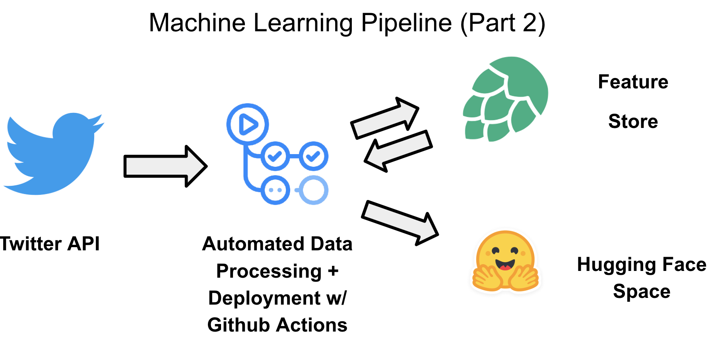

# twitter_sentiment_real_time
Automated real-time sentiment analysis

This application monitors the public's sentiment about chatgpt on Twitter and presents it with a geographical visualization.

  

This project leverages the Twitter API to gather real-time sentiment analysis of tweets mentioning "chatgpt". Using machine learning, each tweet is analyzed for sentiment and the resulting data is stored in a feature store. The automation of this process is achieved through the use of Github actions, which also facilitates the continuous deployment of the application to a Huggingface space.

  

# What I've Learned
* How to build a package with Poetry
* How to use Github actions to establish continuous delivery of an application
* How to build and query a feature store using Hopsworks
* How to deploy a basic application in a Hugging Face Space
* How to perform sentiment analysis using Hugging Face transformers

